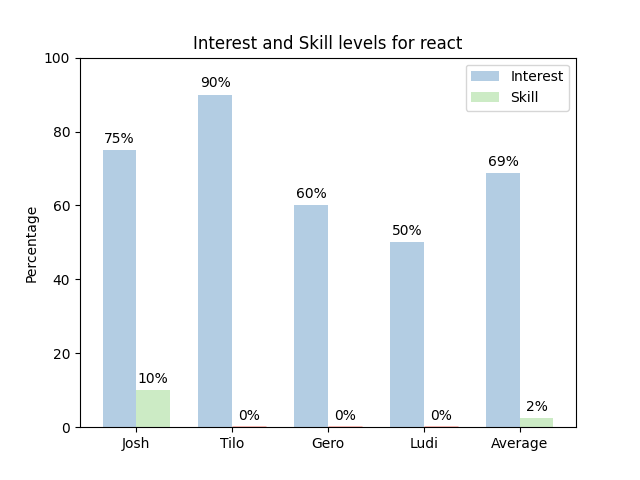
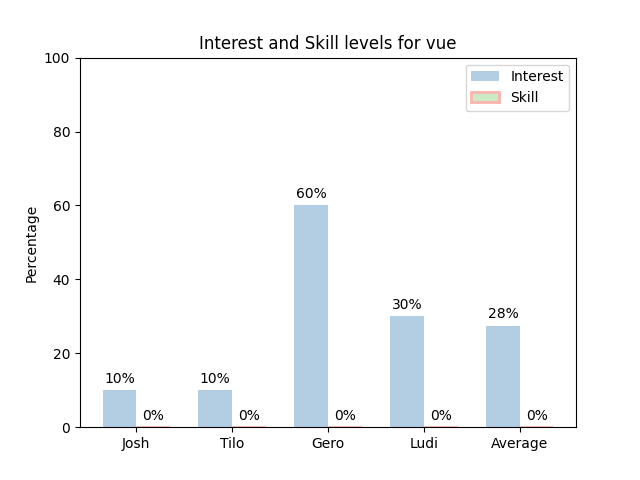

# Themenauswertung für privaten Mini-Hackaton

Dieses Repository enthält eine Themensammlung für einen privaten Mini-Hackaton. Die Themen werden von den Teilnehmern in den Kategorien "Interesse" und "Skill" bewertet.

## Auswertung bearbeiten

Ein Pull Request kann / darf nur von Teilnehmern des Mini-Hackatons erstellt werden und dient der Aktualisierung der Themenliste und der Bewertungen. Folglich können Änderung an folgenden Dateien vorgenommen werden:

- `README.md`: Aktualisierung der Themenliste
- `ratings.json`: Aktualisierung der Bewertungen

Ein gemergeter Pull Request mit Änderungen an `ratings.json` löst eine automatische Aktualisierung der Bewertungs-Grafiken mit einem GitHub Actions Workflow aus.

# Themensammlung

## Dapr (Ereignisgesteuerte Laufzeitumgebung)

- **Verwandte Komponenten und Themen**: 
  - Mikroservice-Architekturen
  - Event-driven Architecture
  - Cloud-Native Anwendungen

- **Typische Anwendungsfälle**: 
  - Vereinfachung der Kommunikation zwischen Mikroservices in einer Cloud-Umgebung, etwa in einer E-Commerce-Anwendung.

- **Beschreibung**: 
  - Dapr ist eine tragbare, ereignisgesteuerte Laufzeitumgebung, die das Erstellen verteilter Mikroservice-Anwendungen erleichtert. Es bietet eine Reihe von APIs, die häufig benötigte Funktionen wie Zustandsmanagement, Messaging und Resilienz abstrahieren.

- **Beispiele für Alternativen**: 
  - Apache Kafka für Event-Streaming
  - Istio als Service Mesh

- **Nützliche Links / Kurze Einführung**: 
  - [Overview | Dapr Docs](https://docs.dapr.io/concepts/overview/)

- **Teilnehmerbewertungen**:

## NATS (Messaging-System)

- **Verwandte Komponenten und Themen**: 
  - IoT (Internet of Things)
  - Echtzeit-Messaging
  - Cloud-Native Messaging

- **Typische Anwendungsfälle**: 
  - Echtzeit-Nachrichtenübermittlung in Systemen wie Live-Chat-Anwendungen, Echtzeit-Dashboard-Updates oder als Kommunikationsschicht für IoT-Geräte.

- **Beschreibung**: 
  - NATS ist ein einfaches, performantes und skalierbares Messaging-System für Cloud-native Anwendungen, IoT-Nachrichtenübermittlung und Mikroservices-Architekturen.

- **Beispiele für Alternativen**: 
  - MQTT für leichtgewichtige IoT-Kommunikation
  - RabbitMQ für komplexere Messaging-Szenarien

- **Nützliche Links / Kurze Einführung**: 
  - [Overview - NATS Docs](https://docs.nats.io/nats-concepts/overview)

- **Teilnehmerbewertungen**:

## Rust (Programmiersprache)

- **Verwandte Komponenten und Themen**: 
  - Systemprogrammierung
  - Parallelverarbeitung
  - WebAssembly

- **Typische Anwendungsfälle**: 
  - Entwicklung hochperformanter Webserver
  - Kryptowährungs-Blockchain-Implementierungen
  - Sichere Systemkomponenten

- **Beschreibung**: 
  - Rust ist eine Programmiersprache, die sich auf Sicherheit, Geschwindigkeit und Parallelverarbeitung konzentriert. Sie wird oft für Systemprogrammierung, Webassembly-Anwendungen und eingebettete Systeme verwendet.

- **Beispiele für Alternativen**: 
  - Go für Systemprogrammierung mit einfacherer Syntax
  - C++ für erprobte Performance und große Ökosysteme

- **Nützliche Links / Kurze Einführung**: 
  - [Introduction - Rust By Example](https://doc.rust-lang.org/rust-by-example/)

- **Teilnehmerbewertungen**:

## SurrealDB (Datenbank)

- **Verwandte Komponenten und Themen**: 
  - Graph-Datenbanken
  - NoSQL-Datenbanken
  - Real-Time Analytics

- **Typische Anwendungsfälle**: 
  - Ideal für komplexe Datenstrukturen in Anwendungen wie sozialen Netzwerken, wo Beziehungen zwischen Datenpunkten wichtig sind, oder für Echtzeit-Analytik in großen Datensätzen.

- **Beschreibung**: 
  - SurrealDB ist eine skalierbare, verteilte, dokumentenorientierte und graphbasierte NoSQL-Datenbank.

- **Beispiele für Alternativen**: 
  - Neo4j als eine andere populäre Graph-Datenbank
  - MongoDB für dokumentenorientierte NoSQL-Anforderungen

- **Nützliche Links / Kurze Einführung**: 
  - [SurrealDB | Documentation | The ultimate multi-model database](https://surrealdb.com/docs/introduction/concepts)

- **Teilnehmerbewertungen**:

## Zig (Programmiersprache)

- **Verwandte Komponenten und Themen**: 
  - Low-Level-Programmierung
  - Performance-kritische Anwendungen

- **Typische Anwendungsfälle**: 
  - Oft für Leistungskritische Software wie Betriebssystem-Komponenten, Spiel-Engines oder High-Performance-Server eingesetzt.

- **Beschreibung**: 
  - Zig ist eine systemnahe Programmiersprache ähnlich C, die auf Einfachheit und Lesbarkeit abzielt.

- **Beispiele für Alternativen**: 
  - C für traditionelle Systemprogrammierung
  - Rust für einen moderneren Ansatz mit Sicherheitsfokus

- **Nützliche Links / Kurze Einführung**: 
  - [Zig Programming Language](https://ziglang.org/)

- **Teilnehmerbewertungen**:

## PCILeech (Memory Attack Software) für Pen Testing

- **Verwandte Komponenten und Themen**: 
  - Hardware-Sicherheit
  - Direct Memory Access (DMA)
  - Sicherheitsforschung

- **Typische Anwendungsfälle**: 
  - Wird in der Sicherheitsforschung und beim Penetration Testing verwendet, um Schwachstellen in der Hardware-Sicherheit und den DMA-Prozessen zu finden.

- **Beschreibung**: 
  - Pcileech konzentriert sich auf Direct Memory Access (DMA) Attacken zum Auslesen und Manipulieren von Systemspeicher.

- **Beispiele für Alternativen**: 
  - Metasploit für ein breites Spektrum an Penetration Testing-Tools
  - Volatility für forensische Analyse des Speichers

- **Nützliche Links / Kurze Einführung**: 
  - [Direct Memory Access (DMA) Attack Software](https://github.com/ufrisk/pcileech#pcileech-summary)

- **Teilnehmerbewertungen**:

## ATmega 16u2 Firmware entwickeln mit LUFA

- **Verwandte Komponenten und Themen**: 
  - Mikrocontroller-Programmierung
  - USB-Kommunikation
  - Embedded Systems

- **Typische Anwendungsfälle**: 
  - Erstellung von benutzerdefinierten USB-Geräten wie Tastaturen, Mäusen oder sogar komplexeren USB-basierten Steuergeräten.

- **Beschreibung**: 
  - LUFA ist ein Open-Source-Framework, das es erleichtert, USB-Anwendungen für die AVR-Reihe von Mikrocontrollern zu entwickeln.

- **Beispiele für Alternativen**: 
  - Arduino für einfachere Mikrocontroller-Projekte
  - STM32 für fortgeschrittene Anwendungen in Embedded Systems

- **Nützliche Links / Kurze Einführung**: 
  - [Four Walled Cubicle - LUFA (Formerly MyUSB)](https://www.fourwalledcubicle.com/LUFA.php)

- **Teilnehmerbewertungen**:

## Rancher (Kubernetes Management Tool)

- **Verwandte Komponenten und Themen**: 
  - Kubernetes-Management
  - Container-Orchestrierung
  - Multi-Cloud-Management

- **Typische Anwendungsfälle**: 
  - Wird für die Vereinfachung der Bereitstellung, Verwaltung und Skalierung von Kubernetes-Clustern verwendet, beispielsweise in großen Unternehmen, die mehrere Cloud-Umgebungen nutzen.

- **Beschreibung**: 
  - Rancher ist eine Open-Source-Plattform zur Verwaltung von Kubernetes in jeder Umgebung.

- **Beispiele für Alternativen**: 
  - OpenShift für eine umfassendere Enterprise-Lösung
  - Kubernetes Dashboard für eine einfachere Kubernetes-Verwaltung

- **Nützliche Links / Kurze Einführung**: 
  - [What is Rancher? | Rancher](https://ranchermanager.docs.rancher.com/)

- **Teilnehmerbewertungen**:

## React (JavaScript Frontend Framework)

- **Verwandte Komponenten und Themen**: 
  - Frontend-Entwicklung
  - Single-Page Applications (SPA)
  - Komponentenbasierte Architektur

- **Typische Anwendungsfälle**: 
  - Entwicklung interaktiver Webanwendungen wie soziale Medien-Plattformen, E-Commerce-Seiten oder komplexe Dashboards.

- **Beschreibung**: 
  - React ist eine JavaScript-Bibliothek zur Erstellung von Benutzeroberflächen, insbesondere Single-Page-Applications.

- **Beispiele für Alternativen**: 
  - Angular für ein umfassenderes Framework
  - Svelte für eine innovative Herangehensweise an reaktive Benutzeroberflächen

- **Nützliche Links / Kurze Einführung**: 
  - [React](https://react.dev/)

- **Teilnehmerbewertungen**:

## Angular (JavaScript Frontend Framework)

- **Verwandte Komponenten und Themen**: 
  - Enterprise-Webanwendungen
  - TypeScript
  - MVVM-Architektur

- **Typische Anwendungsfälle**: 
  - Einsatz für Enterprise-Level-Anwendungen, Progressive Web Apps (PWAs) und Single-Page-Applications mit komplexen Funktionen.

- **Beschreibung**: 
  - Angular ist ein umfassendes Framework für die Entwicklung von Web- und Mobile-Anwendungen in TypeScript.

- **Beispiele für Alternativen**: 
  - React für eine flexiblere Bibliothek zur UI-Entwicklung
  - Vue.js für kleinere und leichter zu lernende Projekte

- **Nützliche Links / Kurze Einführung**: 
  - [Angular](https://angular.io/)

- **Teilnehmerbewertungen**:

## Vue (JavaScript Frontend Framework)

- **Verwandte Komponenten und Themen**: 
  - Progressive Web Apps (PWA)
  - reaktive Benutzeroberflächen
  - VueX für State Management

- **Typische Anwendungsfälle**: 
  - Beliebt für kleine bis mittelgroße Projekte

- **Beschreibung**: 
  - Vue.js ist ein progressives JavaScript-Framework zum Erstellen von Benutzeroberflächen.

- **Beispiele für Alternativen**: 
  - React als eine andere beliebte Bibliothek für User Interfaces
  - Ember.js für konventionenbasierte App-Entwicklung

- **Nützliche Links / Kurze Einführung**: 
  - [Vue.js - The Progressive JavaScript Framework | Vue.js](https://vuejs.org/)

- **Teilnehmerbewertungen**:

